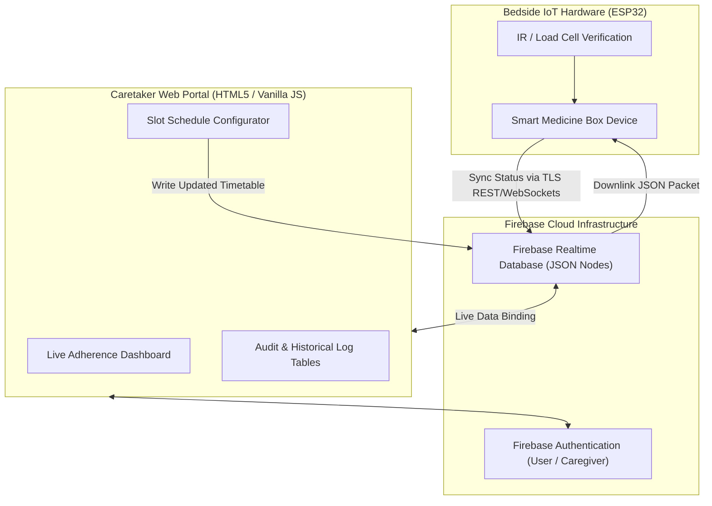

# 💊 Smart Medicine Box — Web Management & Caretaker Telemetry Portal

> **Cloud-Connected Prescription Scheduling, Real-Time Adherence Tracking, and Remote Patient Monitoring Interface.**

[](#)
[](#)
[-success.svg)](../../1_EMBEDDED_SYSTEMS_HARDWARE/B_SENSOR_IOT/Smart_Medicine_Box/README.md)

---

## 📌 Platform Overview

The **Smart Medicine Box Web Platform** is the remote software command center for the physical Smart Medicine Box hardware. While the embedded ESP32 device reliably dispenses pills at the patient's bedside, this web application empowers doctors, remote family members, and professional nursing caretakers to manage schedules and audit compliance in real time from any smartphone or browser.

---

## 🎯 Key Capabilities & Core Features

* **Visual 12-Slot Carousel Manager:** Digital graphical representation of all 12 physical compartments, displaying pill names, scheduled times, and remaining dosage counts.
* **Prescription Schedule Editor:** Intuitive calendar/time picker enabling remote caregivers to update medication timetables without touching the physical device.
* **Real-Time Intake Verification Feed:** Instant visual badges indicating whether a dose was `TAKEN ON TIME`, `DELAYED`, or `MISSED`.
* **Adherence Analytics Dashboard:** Weekly and monthly compliance percentage graphs to share with attending physicians.
* **Emergency Escalation Log:** Records all GSM SMS alerts and buzzer trigger events generated during missed medication windows.

---

## 🏗️ Software Architecture & Cloud Pipeline



---

## 🗄️ Real-Time Database Data Contract

```json
{
  "device_id": "SMB_NODE_01",
  "patient_profile": {
    "name": "Ramesh Sharma",
    "age": 72,
    "emergency_contact": "+91-98XXXXXXXX"
  },
  "slots": {
    "slot_01": {
      "medication_name": "Metformin 500mg",
      "scheduled_time": "08:30",
      "pills_remaining": 14,
      "status": "DISPENSED_AND_VERIFIED",
      "last_taken_timestamp": "2026-10-07T08:32:15Z"
    },
    "slot_02": {
      "medication_name": "Amlodipine 5mg",
      "scheduled_time": "20:00",
      "pills_remaining": 20,
      "status": "SCHEDULED",
      "last_taken_timestamp": null
    }
  },
  "telemetry": {
    "wifi_rssi": -62,
    "battery_backup_pct": 98,
    "last_sync": "2026-10-07T11:24:00Z"
  }
}
```

---

## 🎨 User Interface Design Philosophy

* **High-Contrast Clean Aesthetic:** Clean typography (Inter/Outfit) and distinct color coding:
  * 🟢 **Green Badge:** Verified taken via weight/IR check.
  * 🟡 **Amber Badge:** Window open (alarm sounding at bedside).
  * 🔴 **Red Badge:** Missed dose (caretaker notification sent).
* **Responsive Layout:** Works flawlessly across desktop monitors, iPads, and mobile screens.

---

## 🔗 Related Components

* 📦 **Physical Hardware Node:** [Smart Medicine Box Hardware Documentation](../../1_EMBEDDED_SYSTEMS_HARDWARE/B_SENSOR_IOT/Smart_Medicine_Box/README.md)
* 📜 **Patent Application:** [Official Filing PDF #202621087716](../../1_EMBEDDED_SYSTEMS_HARDWARE/B_SENSOR_IOT/Smart_Medicine_Box/202621087716.pdf)
