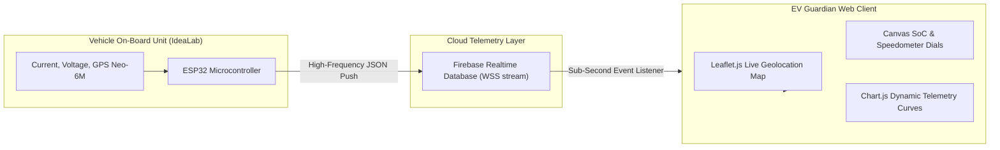

# 🚗 EV Guardian — Web Telemetry & Fleet Management Dashboard

> **Live Electric Vehicle Diagnostics, Battery State-of-Charge (SoC) Gauges, Dynamic Range Estimator, and Real-Time GPS Tracking.**

[](#)
[](#)
[](#)
[](#)

---

## 📌 Executive Overview

The **EV Guardian Web Platform** provides a modern automotive telemetry dashboard engineered to bridge physical EV hardware with drivers and fleet supervisors. Engineered during an industry internship at **AICTE IdeaLab**, the dashboard captures high-frequency sensor streams emitted by the EV Guardian embedded controller and renders actionable diagnostics on an interactive dark-mode glassmorphic interface.

---

## 🎯 Key Dashboard Features

* **Dynamic Battery SoC & Health Gauge:** Real-time circular progress indicator showing current pack State of Charge ($SoC\%$), terminal voltage ($V$), and pack temperature ($^\circ C$).
* **Intelligent Range-to-Empty Gauge:** Dynamically predicted remaining driving range ($km$) updated continuously based on vehicle velocity and moving-average power consumption.
* **Live GPS Fleet Map:** Embedded Leaflet.js map tracking vehicle coordinates in real time with directional heading markers and historical travel path polyline.
* **Time-Series Telemetry Charts:** Interactive Chart.js graphs displaying voltage sag curves, acceleration current draws, and thermal behavior over trip duration.
* **Trip Computer & Efficiency Analytics:** Tracks total distance traveled ($km$), average speed ($km/h$), energy efficiency ($Wh/km$), and carbon offset savings.

---

## 🏗️ End-to-End Telemetry Pipeline



---

## 🗄️ JSON Telemetry Data Contract

The dashboard subscribes to real-time updates pushed from the vehicle under the `/ev_guardian/live_telemetry` node:

```json
{
  "vehicle_id": "EVG_LNCT_01",
  "battery": {
    "voltage_v": 52.4,
    "current_a": 14.8,
    "soc_percent": 78.5,
    "temperature_c": 34.2,
    "health_status": "OPTIMAL"
  },
  "dynamics": {
    "speed_kmh": 42.6,
    "estimated_range_km": 68.4,
    "energy_consumption_wh_km": 32.1
  },
  "location": {
    "latitude": 23.2599,
    "longitude": 77.4126,
    "satellites_locked": 9,
    "timestamp": "2026-10-07T11:24:00Z"
  }
}
```

---

## 🎨 UI Aesthetic & User Experience

* **Dark-Mode Automotive Interface:** Tailored for driver nighttime visibility and reduced glare.
* **Responsive Layout:** Responsive CSS Grid layouts automatically adapting from in-cabin infotainment tablets to smartphone screens and desktop fleet monitors.
* **Subtle Micro-Animations:** Smooth CSS gauge transitions and flashing warning banners if voltage drops below safe thresholds ($<44V$).

---

## 🔗 Related Components

* 📦 **Physical Hardware Node:** [EV Guardian Embedded Telemetry Documentation](../../1_EMBEDDED_SYSTEMS_HARDWARE/A_BATTERY_MANAGEMENT/EV_Guardian/README.md)
* 🤖 **Edge AI Integration:** [Battery State Estimation Edge Models](../../3_MACHINE_LEARNING_EDGE_AI/A_BATTERY_MODELS/README.md)
