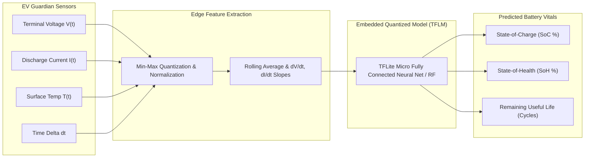

# 🔋 Edge AI Battery Models: SoC, SoH & Degradation Estimation

> **Embedded Machine Learning Models for Accurate State-of-Charge, State-of-Health, and Remaining Useful Life (RUL) Prediction.**

---

## 📌 Theoretical Context & Engineering Need

Traditional battery management systems estimate state metrics using two classical approaches:
1. **Open-Circuit Voltage (OCV) Lookup:** Requires the battery to rest for 30–60 minutes to reach electrochemical equilibrium; entirely unusable during continuous driving.
2. **Coulomb Counting (Current Integration):** Accumulates sensor drift and integration bias over time, resulting in significant cumulative errors ($>15\%$) after multiple driving cycles.

**The Edge AI Solution:** Machine learning models trained on electrochemical drive cycles (NASA Li-ion battery aging datasets & experimental dynamometer logs) learn the non-linear relationship between instantaneous voltage relaxation curves, load spikes, temperature gradients, and actual capacity degradation.

---

## 🏗️ Model Architecture & Inference Pipeline

---

## 🔬 Mathematical Formulations & Feature Vectors

### Input Feature Vector ($X_t$)
$$X_t = \begin{bmatrix} V_t & I_t & T_t & \frac{dV}{dt} & \frac{dI}{dt} & R_{internal, est} \end{bmatrix}^T$$

### Output Target Definitions
* **State of Charge (SoC):** Ratio of currently available electrical charge to rated maximum charge capacity:
  $$SoC(t) = \frac{Q_{available}(t)}{Q_{nominal}} \times 100\%$$
* **State of Health (SoH):** Metric of permanent capacity fade against factory capacity:
  $$SoH(t) = \frac{Q_{max, current}}{Q_{factory, nominal}} \times 100\%$$
  *(When $SoH < 80\%$, automotive packs are decommissioned for second-life stationary storage).*

---

## ⚙️ Quantization & On-Device Deployment

* **Model Training Framework:** Python 3.10, PyTorch / TensorFlow, Scikit-learn.
* **Post-Training Quantization (PTQ):** 32-bit floating-point weights are converted to 8-bit integers (`int8`), reducing model memory footprint from **~450 KB to ~42 KB** with negligible loss in accuracy ($< 0.4\% \, \Delta RMSE$).
* **Microcontroller Footprint:** Fits comfortably within the ESP32 SRAM, executing inference in under **12 milliseconds per step**.

---

## 📁 Related Modules

* 🚗 **Physical Sensing Node:** [EV Guardian Embedded Telemetry](../../1_EMBEDDED_SYSTEMS_HARDWARE/A_BATTERY_MANAGEMENT/EV_Guardian/README.md)
* 🌐 **Live Telemetry Interface:** [EV Guardian Web Dashboard](../../2_SOFTWARE_FULLSTACK/2.%20EV%20Guardian/README.md)
