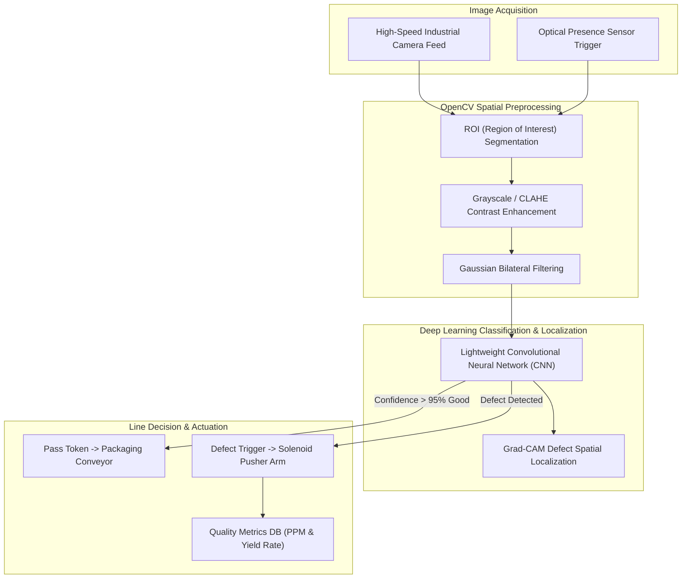

# 🏭 Cognizant Technoverse — AI-Powered Industrial Defect Inspection

> **Automated Edge Computer Vision for High-Speed Quality Inspection, Anomaly Localization, and Smart Factory Defect Sorting.**

---

## 📌 Competition Overview & Problem Statement

Engineered as a submission for the **Cognizant Technoverse Challenge**, this project tackles high-speed quality assurance on modern manufacturing assembly lines.

In precision manufacturing (PCBs, machined automotive gears, semiconductor packaging, glass bottles), micro-defects such as hairline fractures, solder bridges, scratches, and misalignment occur unpredictably. Human visual inspection at line speeds exceeding 5 units per second is physically impossible. This project delivers an automated visual inspection (AVI) edge pipeline capable of identifying and rejecting defective parts in sub-50ms frames.

---

## 🏗️ End-to-End Edge Vision Architecture

---

## 🔬 Technical Methodology & Model Stack

* **Backbone Architecture:** Transfer-learned MobileNetV2 / ResNet-18 fine-tuned on industrial surface defect datasets (MVTec AD benchmark).
* **Defect Classes Identified:**
  1. `Surface Scratch / Abrasion`
  2. `Structural Hairline Crack`
  3. `Component Misalignment / Tilt`
  4. `Pinhole / Void Porosity`
* **Inference Optimization:** Converted via TensorRT / ONNX to optimize float16/int8 execution, achieving **~28ms per frame** on edge accelerators.

---

## 📊 Expected Quality Metrics & Factory Benefits

| Metric | Manual Human Inspection | Cognizant Technoverse AI |
|---|---|---|
| **Inspection Speed** | 1.2 seconds / unit | **0.03 seconds / unit (33x faster)** |
| **Error Rate (False Negatives)** | 8% – 12% (Fatigue induced) | **< 0.8%** |
| **Operation Continuity** | Shift-limited (8 hours) | **Continuous 24/7/365** |
| **Audit Trail** | None / Manual tally | **Timestamped image evidence logs** |
