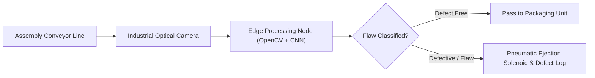

# 🏭 Sub-Division: Industrial AI & Smart Manufacturing

> **Edge Computer Vision, Defect Detection Algorithms, and Predictive Maintenance for Industry 4.0.**

---

## 🎯 Overview

Industry 4.0 requires modern production lines to replace manual optical quality control with autonomous, high-speed vision systems. Manual inspection by human operators is prone to eye fatigue, subjective bias, and throughput constraints.

This sub-division focuses on the deployment of edge artificial intelligence to inspect manufactured goods, classify surface flaws, detect structural fractures, and perform automated defect rejection in real time.

---

## 🗂️ Projects in this Directory

```text
B_MANUFACTURING_AI/
│
└── 📁 Cognizant_Technoverse/
        # Vision-based manufacturing defect detection developed for the Cognizant Technoverse Challenge
    └── 📄 README.md
```

---

## 🛠️ Industrial Edge Vision Pipeline



---

## 🔗 Project Documentation Link

* 👉 [**Cognizant Technoverse AI Inspection Project Detailed README**](./Cognizant_Technoverse/README.md)
