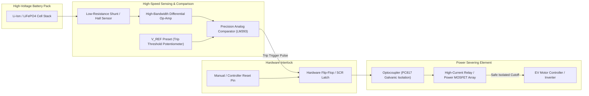

# ⚡ EV Short-Circuit Prevention System

> **Sub-Millisecond High-Current Fault Detection, Arc Suppression, and Hardware Battery Isolation.**

---

## 📌 Problem Formulation & Criticality

Lithium-ion batteries possess exceptionally low internal impedance ($R_{int} \approx 10 - 50 \, m\Omega$). In the event of a mechanical crash, insulation breakdown, moisture ingress, or BMS MOSFET latch-up, a dead short across the power terminals results in instant catastrophic current discharge ($I_{short} > 100A - 500A$).

Under these conditions:
1. **Joule Heating ($P = I^2 R$):** Temperature escalates exponentially within milliseconds.
2. **Thermal Runaway:** Internal separator films melt (>130°C), triggering chemical oxygen release, violent gas venting, and fires.
3. **Conventional Fuse Latency:** Standard slow-blow automotive fuses take several hundred milliseconds to clear, by which time destructive cell degradation has already commenced.

**The Solution:** An active, solid-state electronic fault-protection circuit capable of sensing ultra-steep current slew rates ($dI/dt$) and severing battery output within milliseconds.

---

## ⚙️ Working Principle & Circuit Architecture

---

## 🔬 Hardware Engineering Specifications

| Parameter | Specification | Rationale & Design Choice |
|---|---|---|
| **Max Continuous Current** | 20 A | Calibrated for light electric vehicle prototypes |
| **Trip Threshold ($I_{trip}$)** | 25 A – 30 A (Adjustable) | Triggers above maximum acceleration draw, well below cell damage limit |
| **Response Time** | $< 5 \, ms$ | Analog comparator operates without software interrupt latency |
| **Isolation Barrier** | Optocoupler (5 kV isolation) | Protects low-voltage microcontroller logic from high-voltage transients |
| **Disconnect Element** | Heavy-Duty Relay & Parallel MOSFETs | Eliminates contact chatter and ensures zero forward voltage drop during normal drive |
| **Latching Mechanism** | Hardware SCR / Thyristor Latch | Prevents the system from oscillating ON/OFF if the short remains present |

---

## 🧪 Testing & Validation Results

* **Overcurrent Simulation:** Tested with synthetic low-resistance loads creating sudden current spikes.
* **Cutoff Verification:** Dual-trace oscilloscope capture confirmed the comparator triggers the latch and de-energizes the coil within ~3.2 milliseconds of overcurrent onset.
* **Thermal Validation:** Continuous load operation at 15A steady state showed minimal thermistor rise (<3°C above ambient) on shunt elements.

---

## 🖼️ Media & Hardware Verification

* 📸 [**Short Circuit.jpeg**](./Short%20Circuit.jpeg) — Photograph of the completed hardware breadboard prototype featuring current sensor, comparator stage, relay isolation block, and test load connections.
