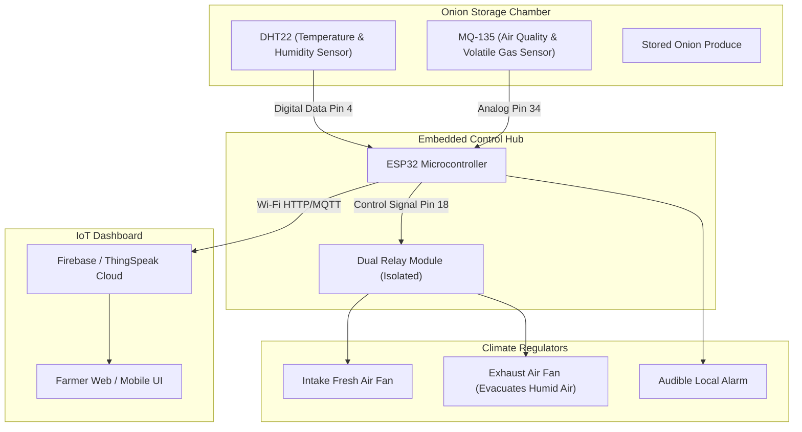

# 🧅 Onion Shelf-Life Increasing & Storage Monitoring System

> **IoT-Enabled Agricultural Microclimate Regulation to Combat Post-Harvest Spoilage.**

---

## 📌 Problem Statement & Agricultural Challenge

In India, post-harvest losses of onions exceed **30%–40% annually**, resulting in massive economic losses for farmers and severe consumer price volatility. The primary causes of spoilage during warehouse storage are:
1. **Excessive Relative Humidity ($RH > 70\%$):** Stimulates fungal spore germination (Aspergillus niger / Black Mold) and bulb rot.
2. **Elevated Ambient Temperature ($T > 30^\circ C$):** Accelerates respiration rates, water loss, and premature sprouting.
3. **Inadequate Airflow & Trapped Volatiles:** Decaying onions release pungent sulphur compounds and ethylene gas ($C_2H_4$), which triggers a cascading chain-reaction rotting neighboring healthy bulbs.

---

## 💡 Proposed Solution

An automated smart storage chamber equipped with environmental sensors, closed-loop ventilation actuation, and IoT cloud logging:
* **Continuous Microclimate Sensing:** Monitors temperature, relative humidity, and air quality indices.
* **Autonomous Climate Control:** Automatically toggles intake and exhaust ventilation fans when humidity or volatile gas concentrations breach preset safe thresholds.
* **Remote Telemetry:** Streams real-time warehouse data to farmer/warehouse manager dashboards via Wi-Fi/GSM.

---

## 🏗️ System Architecture & Working Logic

---

## ⚙️ Threshold Tuning & Control Parameters

| Parameter | Safe Storage Range | Trigger Threshold | Automated Action |
|---|---|---|---|
| **Temperature** | $20^\circ C - 28^\circ C$ | $> 30^\circ C$ | Turn ON cross-ventilation exhaust |
| **Relative Humidity** | $55\% - 65\%$ | $> 70\%$ | Activate high-speed exhaust fan to flush moisture |
| **Volatile Organic Gases** | $< 350 \, ppm$ | $> 500 \, ppm$ | Sound buzzer & run full exhaust to prevent rot spread |

---

## 📸 Prototype Gallery

The directory contains photographic documentation of the operational hardware prototype:
* 🖼️ `WhatsApp Image 2026-01-20 at 2.05.54 PM.jpeg` – Top-down view of sensor placement inside the storage chamber.
* 🖼️ `WhatsApp Image 2026-01-20 at 2.05.54 PM (1-3).jpeg` – Microcontroller board assembly, relay driver wiring, and sensor mounts.
* 🖼️ `WhatsApp Image 2026-01-20 at 2.05.55 PM (1-2).jpeg` – Testing ventilation fan actuation under synthetic humidity loads.
* 🖼️ `WhatsApp Image 2026-01-20 at 2.05.56 PM.jpeg` – Complete enclosure packaging ready for field demonstration.

---

## 🏆 Key Milestone

* 🏅 **Smart India Hackathon (SIH) National Finalist:** Selected among thousands of nationwide submissions for presenting a scalable, low-cost IoT solution to India's agricultural supply-chain crisis.
