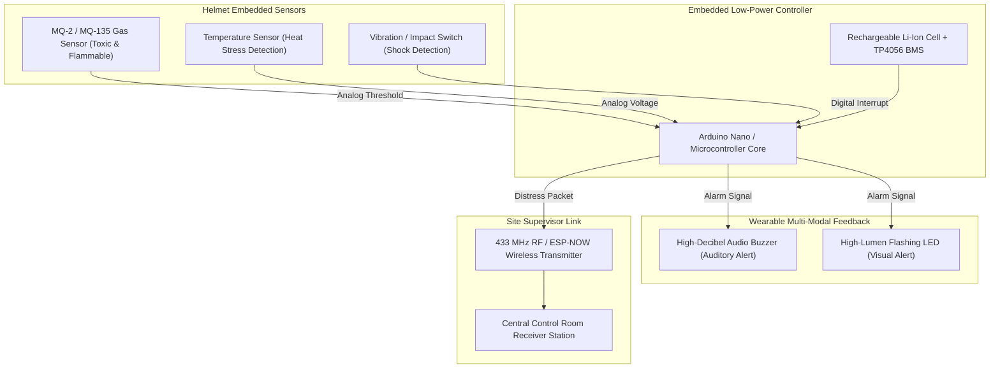

# 🪖 Industrial Safety Helmet for Workers

> **Smart Wearable IIoT Protective Helmet for Real-Time Toxic Gas Detection, Thermal Overload Warning, and Impact Monitoring.**

---

## 📌 Occupational Hazard Context

In mining pits, petrochemical refineries, chemical manufacturing, and heavy construction sites, laborers face invisible and lethal workplace hazards:
1. **Colorless, Odorless Toxic Gases:** Carbon monoxide ($CO$), methane ($CH_4$), hydrogen sulfide ($H_2S$), and LPG leaks.
2. **Extreme Heat Stress:** Elevated internal helmet temperature leading to heat stroke and syncope.
3. **Slips, Trips & Physical Impact:** High-impact debris or sudden falls where an injured worker loses consciousness and cannot call for assistance (Man-Down scenario).

---

## 💡 System Innovation & Working Principle

The **Smart Safety Helmet** embeds multi-hazard detection circuitry directly into standard industrial personal protective equipment (PPE):
* **Toxic/Combustible Gas Sensing:** An MQ-series gas sensor detects dangerous ambient gas concentrations before they reach toxic parts-per-million (PPM) thresholds.
* **Thermal Stress Monitoring:** Internal thermistor probes continuously measure ambient microclimate temperature inside the helmet shell.
* **Impact & Inactivity Trigger:** Motion/tilt sensors recognize hard shock impacts or sudden cessation of worker movement.
* **Multi-Modal Warning System:** Immediate high-decibel piezo buzzer and high-intensity strobe LEDs alert the wearer, while an RF/wireless transmitter relays distress signals to the site safety supervisor.

---

## 🏗️ Hardware Architecture

---

## 🔬 Hardware Specifications

| Component | Function | Operating Specs |
|---|---|---|
| **MQ Gas Sensor** | Flammable & Toxic Gas Sniffer | Detects LPG, $CH_4$, Smoke ($200 - 10000 \, ppm$) |
| **Thermistor / LM35** | Microclimate Helmet Heat Probe | Scaled to trigger warnings above $42^\circ C$ |
| **Shock / Tilt Switch** | Mechanical Impact / Fall Sensor | Detects heavy impacts ($>3G$ equivalent) |
| **Piezo Buzzer** | Close-proximity audio alert | $85 \, dB$ output at $10 \, cm$ |
| **Lithium Battery Module** | Lightweight onboard wearable power | 3.7V 800mAh Li-Po with TP4056 overdischarge protection |

---

## 🖼️ Prototype Photograph

* 📸 [**Safety Helmet For Workers.jpeg**](./Safety%20Helmet%20For%20Workers.jpeg) — Photograph of the completed industrial safety helmet prototype showing integrated sensor cluster, warning LED, and internal wiring harness.
