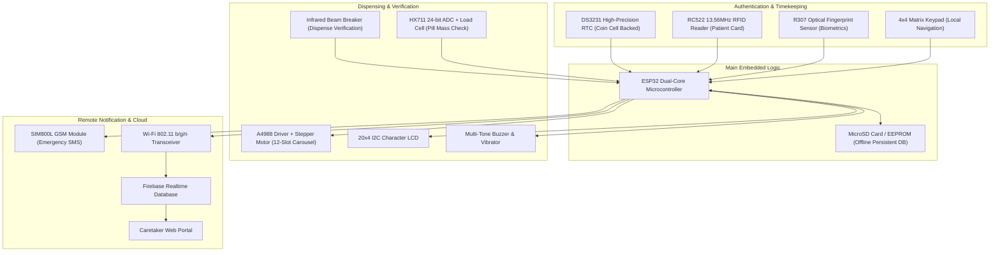

# 💊 Smart Medicine Box (SMB) — Advanced IoT Medication Dispenser

> **Patented Multi-Slot Automated Medication Management System with Biometric Authentication, Multi-Sensor Adherence Verification, and Offline-First Cloud Synchronization.**

---

## 📜 Intellectual Property & Accolades

* 🏆 **Patent Application Number:** `202621087716` (Official patent filing document included: [**202621087716.pdf**](./202621087716.pdf))
* 🏥 **Hackathon Honors:** Developed and selected under the **AICTE CIBIP Hackathon for Medical Health**
* 🌐 **Companion Web Portal:** See [`2_SOFTWARE_FULLSTACK/1.Smart Medicine Box`](../../../2_SOFTWARE_FULLSTACK/1.Smart%20Medicine%20Box/README.md)

---

## 📌 Clinical & Societal Challenge

Medication non-adherence is a silent global epidemic. According to the World Health Organization (WHO), over **50% of chronic patients (elderly, Alzheimer's, Parkinson's, diabetic, hypertensive)** fail to take medications as prescribed, causing hundreds of thousands of preventable hospitalizations each year.

Key failure points of conventional pill organizers:
1. **Accidental Double Dosing or Skipped Doses:** Cognitive decline leads to confusion regarding whether pills were taken.
2. **Access by Unauthorized Individuals:** Small children or cognitively impaired adults can open conventional organizers and ingest dangerous dosages.
3. **Loss of Network Connectivity:** Many IoT pillboxes fail completely when residential Wi-Fi drops, causing missed alarms.
4. **Lack of Caretaker Accountability:** Doctors and remote family members have no objective proof of whether pills were merely dispensed or actually consumed.

---

## 💡 System Innovation & Engineering Architecture

The **Smart Medicine Box (SMB)** solves every failure point through a synchronized electromechanical, sensory, and cloud framework:

---

## ⚙️ Key Technical Features

### 1. 12-Compartment Indexed Carousel
* Precision 360° cylindrical carousel divided into 12 distinct medication chambers.
* Driven by a bipolar stepper motor calibrated to exact angular increments ($30^\circ$ steps per compartment), ensuring zero jamming and exact alignment over the dispense chute.

### 2. Dual-Factor Patient Authentication
* **RFID Smart Card:** Instant touch-and-unlock for elderly patients.
* **Optical Fingerprint Scanner (R307):** Biometric identity verification preventing unauthorized access by siblings or unauthorized caregivers.

### 3. Dual-Stage Physical Intake Verification
* **IR Optical Beam Breaker:** Confirms that pills successfully dropped through the exit funnel.
* **HX711 Strain Gauge Load Cell:** Measures before-and-after weight down to $0.1g$ to verify that the patient actually retrieved the medicine rather than letting it sit in the cup.

### 4. Resilient Offline-First Architecture
* If internet connectivity is interrupted, the internal **DS3231 RTC** triggers scheduled alarms locally without fail.
* All timestamped dispensing events are cached to non-volatile local storage.
* Upon Wi-Fi re-establishment, queued synchronization packets flush automatically to the cloud.

### 5. Multi-Channel Caretaker Telemetry
* If the patient fails to take medication within 15 minutes of the scheduled window, the **SIM800L GSM module** dispatches an urgent SMS alert directly to the caretaker's mobile phone, followed by a status push to the web dashboard.

---

## 📋 Comprehensive Pin & Hardware Mapping

| Module / Component | Bus / Protocol | ESP32 GPIO Pins | Function |
|---|---|---|---|
| **DS3231 RTC** | I2C | `GPIO 21 (SDA), GPIO 22 (SCL)` | Battery-backed scheduling |
| **I2C 20x4 LCD** | I2C | `GPIO 21 (SDA), GPIO 22 (SCL)` | Instructions, doctor notes, clock |
| **RC522 RFID** | SPI | `GPIO 5 (SS), 18 (SCK), 19 (MISO), 23 (MOSI)` | Patient card scan |
| **R307 Fingerprint** | UART | `GPIO 16 (RX2), GPIO 17 (TX2)` | Biometric verification |
| **A4988 Stepper Driver** | Digital Out | `GPIO 26 (STEP), GPIO 27 (DIR), GPIO 14 (ENABLE)` | Carousel motor indexing |
| **HX711 Load Cell** | 2-Wire Serial | `GPIO 32 (DOUT), GPIO 33 (SCK)` | Pill weight confirmation |
| **IR Barrier Sensor** | Digital In | `GPIO 35 (ADC1_CH7)` | Chute drop detector |
| **SIM800L GSM Module** | Software UART | `GPIO 4 (RX), GPIO 2 (TX)` | Caretaker SMS emergency alerts |
| **Buzzer / Alarm** | PWM Out | `GPIO 25` | Chime reminder melody |

---

## 📁 Repository Directory Contents

* 📄 [**202621087716.pdf**](./202621087716.pdf) — Complete official Patent Application Filing document.
* 📸 [**Snapchat-20847718.jpg**](./Snapchat-20847718.jpg) — Photograph of the operational 12-slot physical prototype during assembly and testing.
* 🌐 **Full-Stack Software UI:** Documented under [`2_SOFTWARE_FULLSTACK/1.Smart Medicine Box`](../../../2_SOFTWARE_FULLSTACK/1.Smart%20Medicine%20Box/README.md).
