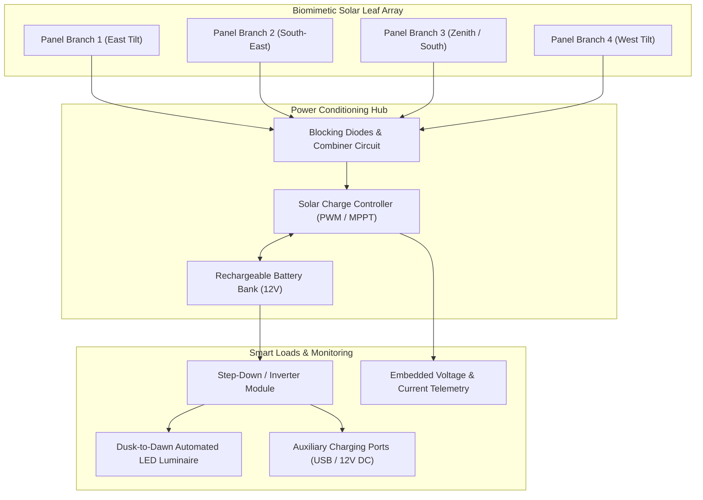

# ☀️ Solar Tree — Biomimetic Renewable Energy Harvester

> **Multi-Angle Photovoltaic Solar Tree Structure with Integrated Charge Regulation and Distributed Urban Power Output.**

---

## 📌 Concept & Environmental Motivation

Conventional flat-roof solar installations suffer from severe structural and temporal limitations:
1. **High Land Footprint:** Traditional ground-mounted solar farms require vast horizontal acreage, making them unfeasible for congested urban spaces, campuses, and parks.
2. **Fixed Angular Inefficiency:** Flat panels only achieve peak irradiance for a brief window at solar noon. Throughout early morning and late afternoon, significant cos-loss ($\cos \theta$) occurs.
3. **Shading Losses:** Partial cloud cover or architectural shading across a single string heavily degrades string performance.

---

## 💡 Engineering Innovation

The **Solar Tree** emulates natural arboreal phyllotaxy (the spiraling arrangement of leaves along a stem). By mounting multiple smaller solar photovoltaic modules at staggered elevations and varying azimuthal angles around a central vertical trunk:
* **All-Day Solar Capture:** Early morning panels face eastward, midday panels face southward, and afternoon panels face westward, maintaining high, smooth aggregate power output across daylight hours.
* **90% Smaller Ground Footprint:** Requires only the base footprint of the central trunk post, allowing pedestrian walkways, EV charging ports, or gardening systems beneath.
* **Integrated Storage & Micro-Inverter:** Captured energy is regulated through a charge controller into a deep-cycle battery bank, supplying local LED illumination and USB/auxiliary power outlets.

---

## 🏗️ System Architecture & Energy Flow

---

## 🔬 Mechanical & Electrical Specifications

| Parameter | Specification | Engineering Benefit |
|---|---|---|
| **Structure Geometry** | Multi-tier central steel pillar with radiating arms | Maximizes structural rigidity against wind shear |
| **Panel Arrangement** | Staggered azimuth ($60^\circ$ radial separation) | Prevents upper panels from casting shade on lower panels |
| **System Voltage** | 12V DC Nominal | Compatible with standard lead-acid / LiFePO4 cells |
| **Charge Regulation** | Reverse-current blocking Schottky diodes + Charge Controller | Prevents reverse battery discharge at night |
| **Autonomous Lighting** | LDR / Solar panel Voc sensing | Automatically powers street lights at sunset |

---

## 🌟 Public Exhibition & Recognition

* 🏅 **Vigyan Mela 2025:** Officially selected and demonstrated at the prestigious **Vigyan Mela 2025 Science & Technology Exhibition**, garnering praise from researchers, academics, and industry delegates for innovative urban space utilization.

---

## 📸 Prototype Gallery

* 🖼️ [**Solar Tree 1.jpg**](./Solar%20Tree%201.jpg) — Full exterior elevation of the completed Solar Tree prototype structure.
* 🖼️ [**Solar Tree 2.jpg**](./Solar%20Tree%202.jpg) — Close-up view of panel branch articulation and cabling harness.
* 🖼️ [**IMG20250906135204.jpg**](./IMG20250906135204.jpg) — Exhibition stand setup and battery storage enclosure.
* 🖼️ [**IMG20250906135211.jpg**](./IMG20250906135211.jpg) — Angle calibration of photovoltaic leaves.
* 🖼️ [**IMG20250906135219.jpg**](./IMG20250906135219.jpg) — Central wiring junction and distribution node.
* 🖼️ [**IMG20250906135234.jpg**](./IMG20250906135234.jpg) — Live demonstration during daytime charging cycle.
