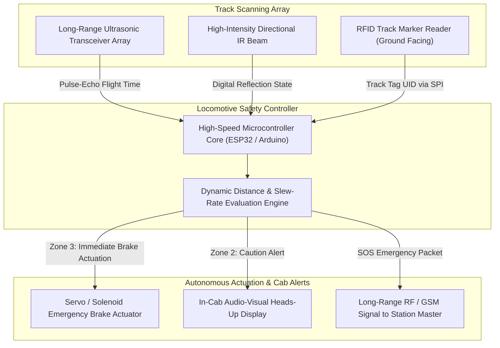

# 🚨 Railway Obstacle Avoidance & Collision Prevention System

> **Automated Railway Track Hazard Detection, Multi-Stage Proximity Warning, and Autonomous Emergency Braking Architecture.**

---

## 🏆 Honours & Recognitions

* 🏅 **Smart India Hackathon (SIH 2025) National Finalist:** Selected by the Ministry of Railways / SIH evaluation panel among nationwide submissions for a deployable track-clearance prototype.
* 🌟 **Vigyan Mela 2025 Demonstration:** Live physical track and locomotive model showcased to top scientists, engineers, and government delegates.
* 💼 **Direct Industry Internship Offer:** Earned an on-the-spot industry internship offer following the live demonstration of the hardware at Vigyan Mela 2025.

---

## 📌 Problem Formulation & Railway Challenge

Railway networks carry millions of passengers and billions of tons of freight daily. However, derailments and catastrophic head-on collisions remain persistent threats due to:
1. **Unmonitored Track Obstacles:** Fallen trees, rockslides, stranded motor vehicles at unmanned level crossings, and stray livestock.
2. **High Inertia & Long Braking Distances:** High-speed trains travelling at $100 - 160 \, km/h$ require upwards of $600 - 1000 \, meters$ of emergency braking distance. Human loco-pilots cannot spot distant nighttime obstructions in time.
3. **Severe Weather & Fog Blindness:** Dense winter fog in Northern and Central India reduces human visual range to less than $50 \, meters$, causing massive slowdowns and collision risks.

---

## 💡 System Innovation & Engineering Concept

The system provides an active electronic shield in front of the locomotive, coupled with fixed trackside sensing:
* **Multi-Stage Sensing Array:** Integrates long-range ultrasonic transceivers, directional infrared sensors, and RFID track markers to scan the rail corridor.
* **Three-Zone Dynamic Safety Horizon:**
  * **Zone 1 (Green / Clear - $> 500m$ scale):** Track clear; regular cruising throttle.
  * **Zone 2 (Yellow / Caution - $200m - 500m$ scale):** Obstacle detected; activates cab audio-visual alarm, flashes high-intensity strobe, cuts locomotive throttle.
  * **Zone 3 (Red / Emergency - $< 200m$ scale):** Immediate autonomous pneumatic/servo emergency brake deployment and distress signal broadcast.
* **RFID Spatial Track Geofencing:** RFID tags installed along ties/sleepers inform the locomotive of sharp bends, level crossings, and tunnel entrances to dynamically adapt sensor sensitivity.

---

## 🏗️ System Architecture & Workflow

---

## 🔬 Hardware Specifications & Pin Configuration

| Subsystem | Hardware Component | Protocol / Pinout | Functional Description |
|---|---|---|---|
| **Primary Distance Sensor** | HC-SR04 / JSN-SR04T Waterproof Sonar | `TRIG: GPIO 12`, `ECHO: GPIO 14` | Emits 40 kHz ultrasonic burst to calculate obstacle distance |
| **Track Level Sensor** | High-Sensitivity Optical IR Sensor | `DO: GPIO 27` | Detects close-proximity track bed deviations |
| **Track Marker Reader** | RC522 RFID 13.56 MHz Module | SPI (`GPIO 5, 18, 19, 23`) | Identifies curve markers, crossing zones, and speed zones |
| **Brake Actuator** | High-Torque Servo Motor (MG996R) | `PWM: GPIO 13` | Mechanically throws emergency brake lever upon Zone 3 trigger |
| **Locomotive Cab Display** | 16x2 I2C Character Display | `I2C: GPIO 21 (SDA), 22 (SCL)` | Shows live clearance distance, zone status, and speed limit |
| **Emergency Telemetry** | 433 MHz RF / GSM Transmitter | `UART / Digital Pin` | Broadcasts collision hazard coordinates to oncoming trains |

---

## 📸 Photographic Evidence & Prototype Documentation

The folder includes full visual records of the track prototype and exhibition setup:
* 🖼️ [**IMG20250426001350.jpg**](./IMG20250426001350.jpg) — Initial sensor wiring, breadboard calibration, and ultrasonic echo verification.
* 🖼️ [**IMG20250426182645.jpg**](./IMG20250426182645.jpg) — Scale model railway track integration with sensor bracket mounted on locomotive front.
* 🖼️ [**IMG20250426182652.jpg**](./IMG20250426182652.jpg) — Angle and beam divergence calibration to eliminate false alarms from track ballast.
* 🖼️ [**IMG20250426182726.jpg**](./IMG20250426182726.jpg) — Testing obstacle detection with simulated vehicular barriers.
* 🖼️ [**IMG20250506031853.jpg**](./IMG20250506031853.jpg) — Complete system packaging, including display module and motor driver.
* 🖼️ [**IMG20250506031904.jpg**](./IMG20250506031904.jpg) — Top-down view of track alignment and power harness.
* 🖼️ [**IMG20250506032012.jpg**](./IMG20250506032012.jpg) — Full track demonstration ready for Vigyan Mela presentation.
