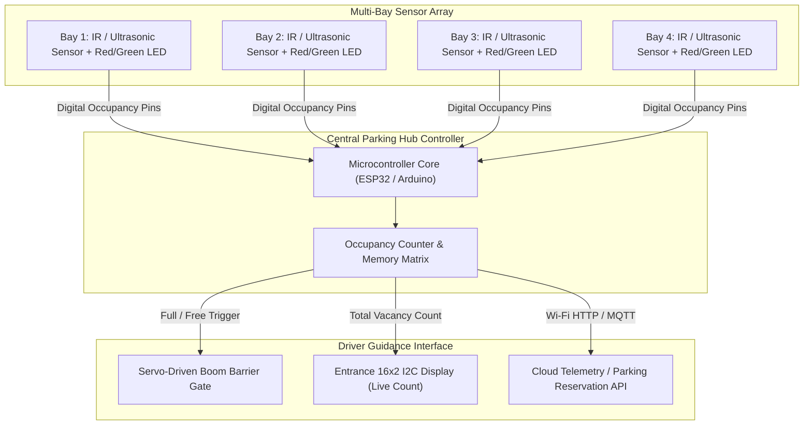

# 🅿️ Smart Parking Guidance & Bay Occupancy System

> **IoT-Enabled Parking Space Detection, Real-Time Bay Availability Signage, and Automated Entry Gate Control.**

---

## 📌 Urban Mobility Problem

In dense commercial centers, shopping complexes, and transit hubs:
* Drivers spend an average of **15 to 20 minutes** circling multi-level parking lots searching for open bays.
* This "cruising for parking" generates up to **30% of downtown traffic congestion**, wasting fossil fuels and compounding carbon emissions.
* Conventional lots lack real-time digital visibility, resulting in underutilized back bays and chaotic choke points near entry ramps.

---

## 💡 System Innovation & Working Architecture

Developed during an **Industry Engineering Internship**, this hardware prototype automates real-time spot occupancy management:
* **Per-Bay Optical / Ultrasonic Sockets:** Overhead or ground-level sensors detect the physical presence of a parked chassis.
* **Bi-Color Bay Status LEDs:** Each parking slot features a dedicated visual indicator:
  * 🟢 **Green:** Slot is vacant and ready for parking.
  * 🔴 **Red:** Slot is occupied.
* **Entrance Guidance Display:** A centralized LCD/LED digital totem at the facility entrance greets oncoming drivers with exact live counts: `Slots Available: 04 / Total: 08`.
* **Automated Access Gate (Servo Barrier):** When total capacity is reached, the entry barrier automatically locks, displaying a `PARKING FULL` alert to prevent gridlock inside the facility.

---

## 🏗️ Hardware Architecture & Flow

---

## 🔬 Hardware Specifications & Pin Mapping

| Component | Interface / Type | Pin Connection | Role |
|---|---|---|---|
| **Bay Sensors 1–4** | Digital Optical IR Probes | `GPIO 13, 12, 14, 27` | Detects reflected light when a vehicle is stationed above |
| **Bay Indicator LEDs** | Dual-color Red/Green LEDs | Paired with Sensor Digital Outputs | Instant visual guidance for drivers navigating lanes |
| **Entrance Display** | 16x2 I2C LiquidCrystal | `SDA: GPIO 21`, `SCL: GPIO 22` | Displays live available slots counter |
| **Barrier Gate Actuator** | Micro Servo (SG90) | `PWM: GPIO 15` | Opens barrier when slots $> 0$; locks when full |
| **System Power** | Regulated 5V DC Supply | LM7805 Step-Down | Powers multiple optical pairs without voltage drop |

---

## 📸 Prototype Documentation & Photos

* 🖼️ [**WhatsApp Image 2026-06-02 at 03.34.14.jpeg**](./WhatsApp%20Image%202026-06-02%20at%2003.34.14.jpeg) — Multi-slot parking bed model with vehicle detection sensors and entrance gate integration.
* 🖼️ [**WhatsApp Image 2026-06-02 at 03.34.14 (1).jpeg**](./WhatsApp%20Image%202026-06-02%20at%2003.34.14%20(1).jpeg) — Wiring harness, microcontroller breadboard layout, and LED status verification under active test loads.
