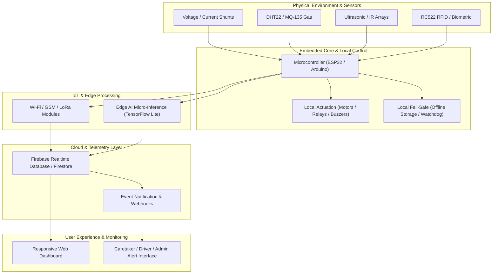

# 🚀 Devansh Arjariya — Engineering Projects Portfolio

> **A Comprehensive Three-Year Engineering Journey across Embedded Systems, IoT, Hardware Design, Edge AI, Full-Stack Telemetry, and Smart Automation.**

[](https://lnct.ac.in)
[](./1_EMBEDDED_SYSTEMS_HARDWARE/B_SENSOR_IOT/Smart_Medicine_Box/202621087716.pdf)
[-orange.svg)](./5_ACHIEVEMENTS_RECOGNITION/)
[](./5_ACHIEVEMENTS_RECOGNITION/)

---

## 📖 Executive Summary

This repository represents the consolidated engineering portfolio of **Devansh Arjariya** (Electronics & Communication Engineering, LNCT Group of Institutes, Bhopal). Rather than isolated textbook exercises, every project here stems from a real-world engineering challenge—ranging from electric vehicle telemetry and high-voltage battery safety to healthcare automation, agricultural supply-chain preservation, industrial worker safety, and intelligent transportation.

The journey chronicles an intentional progression across four distinct developmental phases:
1. **Phase 1: Fundamental Electronics & Solid-State Switching** (Sensors, transistor logic, sound triggers, home automation)
2. **Phase 2: Microcontroller Interfacing & IoT Telemetry** (ESP32/Arduino, cloud databases, wireless nodes, agricultural monitoring)
3. **Phase 3: Mission-Critical Integrated Systems & Mechatronics** (Multi-sensor biometric systems, patent-filed healthcare dispensing, railway hazard detection, EV short-circuit isolation)
4. **Phase 4: Edge AI & Cloud Full-Stack Dashboards** (On-device machine learning inference, real-time web telemetry, battery degradation estimation)

---

## 🗂️ Repository Master Architecture

The repository is cleanly structured into 5 foundational pillars mirroring real-world R&D divisions:

```text
Devansh_projects_template/
│
├── 📁 1_EMBEDDED_SYSTEMS_HARDWARE/      # Physical prototypes, firmware, schematics & PCB logic
│   ├── 📁 A_BATTERY_MANAGEMENT/        # EV Guardian & EV Short-Circuit Prevention System
│   ├── 📁 B_SENSOR_IOT/                # Onion Shelf-Life (SIH), Safety Helmet, Smart Medicine Box (Patent), Solar Tree
│   ├── 📁 C_INDUSTRIAL_AUTOMATION/     # Clap-Based Switching & RFID Smart Attendance
│   └── 📁 D_TRANSPORTATION_SAFETY/     # Railway Obstacle Avoidance (SIH & Vigyan Mela) & Smart Parking System
│
├── 📁 2_SOFTWARE_FULLSTACK/             # Web dashboards, real-time telemetry UIs & caretaker portals
│   ├── 📁 1.Smart Medicine Box/        # Caretaker scheduling, dispensing log & patient dashboard
│   └── 📁 2. EV Guardian/              # Live EV telemetry, battery pack visualizer & GPS route mapping
│
├── 📁 3_MACHINE_LEARNING_EDGE_AI/       # Edge inference models, battery analytics & industrial vision
│   ├── 📁 A_BATTERY_MODELS/            # SoC/SoH prediction, thermal runaway detection & RUL models
│   └── 📁 B_MANUFACTURING_AI/          # Industrial defect detection & predictive maintenance
│       └── 📁 Cognizant_Technoverse/   # AI challenge submission for automated manufacturing inspection
│
├── 📁 4_DOCUMENTATION_GUIDES/           # Technical manuals, circuit blueprints & reference schematics
│   ├── 📁 A_HARDWARE_CIRCUITS/         # Schematics, pinouts & wiring guides
│   ├── 📁 B_SETUP_GUIDES/              # Toolchain installation, compiler flags & IDE configuration
│   ├── 📁 C_API_REFERENCES/            # REST/Firebase schemas, payload specifications & packet definitions
│   └── 📁 D_TROUBLESHOOTING/           # Common hardware bugs, brownout mitigations & debug logs
│
└── 📁 5_ACHIEVEMENTS_RECOGNITION/       # Patent certificate, SIH awards, hackathons & recognitions
    └── 📄 Devansh Arjariya Certificates.pdf
```

---

## 📊 Comprehensive Project Matrix

| Project | Domain | Key Hardware & Tech | Key Role / Highlight | Status / Accolades | Sub-Folder README |
|---|---|---|---|---|---|
| **EV Guardian** | EV Telemetry & IoT | ESP32, GPS Neo-6M, Current/Voltage Sensors, Firebase, Web UI | Live battery pack health, range estimation & geolocation tracking (Developed at IdeaLab) | Deployed & Tested | [Explore](./1_EMBEDDED_SYSTEMS_HARDWARE/A_BATTERY_MANAGEMENT/EV_Guardian/README.md) |
| **EV Short-Circuit Protection** | High-Current Safety | Hall Sensors, High-Speed Relays, MOSFET Driver, Optoisolator | Sub-millisecond power isolation to halt thermal runaway & fires | Prototype Validated | [Explore](./1_EMBEDDED_SYSTEMS_HARDWARE/A_BATTERY_MANAGEMENT/EV_Short_Circuit_Prevention/README.md) |
| **Onion Shelf-Life Extender** | AgriTech IoT | DHT22, MQ-135 Gas Sensor, ESP32, Exhaust Actuation | Atmospheric chamber regulator preventing fungal rot & humidity decay | **Smart India Hackathon Finalist** | [Explore](./1_EMBEDDED_SYSTEMS_HARDWARE/B_SENSOR_IOT/Onion_Shelf_Life/README.md) |
| **Industrial Safety Helmet** | Worker Safety & IIoT | Toxic Gas Sensors, Accelerometer (Fall Detection), Buzzer, RF | Real-time hazard warning & man-down detection for construction/mining | Prototype Validated | [Explore](./1_EMBEDDED_SYSTEMS_HARDWARE/B_SENSOR_IOT/Safety_Helmet/README.md) |
| **Smart Medicine Box (SMB)** | Healthcare IoT | ESP32, Stepper Motor, RFID, Fingerprint, RTC, IR, Load Cell | 12-slot scheduled medication dispenser with offline-first synchronization | **Patent Filed (#202621087716)** / AICTE CIBIP Hackathon | [Explore](./1_EMBEDDED_SYSTEMS_HARDWARE/B_SENSOR_IOT/Smart_Medicine_Box/README.md) |
| **Solar Tree Structure** | Clean Energy & Harvesting | Multi-tilt Solar PVs, MPPT/Charge Controller, Lead/Li-Ion Pack | Biomimetic spiraled solar array maximizing multi-angle sunlight capture | **Exhibited at Vigyan Mela 2025** | [Explore](./1_EMBEDDED_SYSTEMS_HARDWARE/B_SENSOR_IOT/Solar_Tree/README.md) |
| **Clap-Based Switching** | Home Automation | Electret Mic, Operational Amplifier, 555 Timer / CD4017, Relay | Hands-free acoustic pattern appliance control (Semester 1 foundational project) | Completed & Tested | [Explore](./1_EMBEDDED_SYSTEMS_HARDWARE/C_INDUSTRIAL_AUTOMATION/Clap_Based_Switching/README.md) |
| **RFID Smart Attendance** | Industrial & Campus IoT | RC522 RFID Reader, Arduino/ESP32, I2C LCD, EEPROM / Cloud DB | Fast contactless digital registration eliminating paper rosters | Deployed & Tested | [Explore](./1_EMBEDDED_SYSTEMS_HARDWARE/C_INDUSTRIAL_AUTOMATION/RFID_Attendance/README.md) |
| **Railway Obstacle Avoidance** | Railway Safety | Ultrasonic Array, IR Sensors, RFID Track Markers, Microcontroller | Automated track hazard detection and automated emergency brake signaling | **SIH 2025 Finalist** / **Vigyan Mela Offer** | [Explore](./1_EMBEDDED_SYSTEMS_HARDWARE/D_TRANSPORTATION_SAFETY/Railway_Obstacle_Avoidance/README.md) |
| **Smart Parking Guidance** | Smart Infrastructure | IR/Ultrasonic Spot Sensors, LED Matrix, Microcontroller, Web Portal | Live bay availability detection eliminating manual vehicle search congestion | Developed during Industry Internship | [Explore](./1_EMBEDDED_SYSTEMS_HARDWARE/D_TRANSPORTATION_SAFETY/Smart_Parking_System/README.md) |
| **Smart Medicine Box Web** | Full-Stack Healthcare | HTML5, CSS3, Vanilla JS, Firebase Realtime DB, Auth | Cloud caretaker portal for prescription scheduling and adherence logs | Deployed | [Explore](./2_SOFTWARE_FULLSTACK/1.Smart%20Medicine%20Box/README.md) |
| **EV Guardian Web Portal** | Full-Stack Telemetry | Responsive Web UI, Firebase SDK, Leaflet/Mapbox API, Chart.js | Real-time vehicle vitals dashboard, state-of-charge gauge & GPS breadcrumbs | Deployed | [Explore](./2_SOFTWARE_FULLSTACK/2.%20EV%20Guardian/README.md) |
| **Battery Edge AI Models** | Edge Intelligence | Python, TensorFlow Lite, Scikit-learn, Embedded C++ | Machine learning on embedded devices for SoC/SoH and battery anomaly detection | R&D Active | [Explore](./3_MACHINE_LEARNING_EDGE_AI/A_BATTERY_MODELS/README.md) |
| **Cognizant Technoverse AI** | Computer Vision / IIoT | OpenCV, CNNs, Edge AI Inference, Python | Vision-based industrial quality inspection and automated anomaly rejection | Hackathon Project | [Explore](./3_MACHINE_LEARNING_EDGE_AI/B_MANUFACTURING_AI/Cognizant_Technoverse/README.md) |

---

## 🗺️ Architectural Workflow: End-to-End System Flow



---

## 🛠️ Technology Stack & Engineering Toolchain

### Hardware & Circuit Design
* **Microcontrollers & MCUs:** ESP32 (Dual Core Xtensa 32-bit), ESP8266, Arduino Nano/Uno (ATmega328P), 8051 variants
* **Protocols & Busses:** I2C, SPI, UART, GPIO, ADC, PWM, 1-Wire
* **Sensors & Input Devices:** ACS712 / INA219 current sensors, DHT11/DHT22, MQ-2 / MQ-135, RC522 RFID, Neo-6M GPS, Load Cells (HX711), Optical Fingerprint (R307), IR Obstacle Sensors, Ultrasonic HC-SR04
* **Power Electronics & Actuation:** High-speed Relays, MOSFET Driver Gates, NEMA Stepper Motors (A4988/DRV8825), SG90 Servos, MPPT solar controllers, Li-ion battery arrays

### Embedded Firmware
* **Languages:** Embedded C, C++, Arduino Core, MicroPython
* **Libraries & Frameworks:** FreeRTOS (ESP-IDF tasks), AccelStepper, Wire, SPI, TinyGPS++, Firebase-ESP-Client, LiquidCrystal_I2C, Adafruit Sensor Suite

### Software, Cloud & Full-Stack
* **Frontend:** HTML5, CSS3, Modern ES6+ JavaScript, Responsive Layouts, Glassmorphic UI design
* **Cloud & Backend:** Firebase Realtime Database, Firestore, Firebase Authentication, Cloud Storage
* **Telemetry & Visualization:** Chart.js, Leaflet.js mapping, Canvas gauges, CSS micro-animations

### Machine Learning & Edge Computing
* **Frameworks:** Python, NumPy, Pandas, Scikit-learn, TensorFlow Lite for Microcontrollers (TFLM)
* **Domains:** Regression (Battery SoC/SoH), Classification (Fault types), Computer Vision (Technoverse defect detection)

---

## 🏆 Key Achievements & Milestones

* 📜 **Patent Filed:** Smart Medicine Box (Application **#202621087716**) — Advanced IoT multi-slot medical dispensing system with offline-first synchronization.
* 🧅 **Smart India Hackathon (SIH) Finalist:** Onion Shelf-Life Preservation System — National level finalist for automated post-harvest AgriTech storage solution.
* 🚆 **Smart India Hackathon (SIH 2025) Finalist:** Railway Track Obstacle Avoidance & Collision Prevention System.
* 🌟 **Vigyan Mela 2025 Honors:** Selected exhibitor for the Railway Safety System and Solar Tree structure; received on-spot corporate internship offer for engineering execution.
* 🏭 **AICTE CIBIP Hackathon:** Developed Smart Medicine Box hardware under the Healthcare & Medical Equipment track.
* 💡 **LNCT IdeaLab Internship:** Engineered the complete hardware telemetry and cloud dashboard for **EV Guardian**.

---

## 💡 Engineering Philosophy

> **"Build → Break → Measure → Debug → Re-engineer → Document"**

This portfolio demonstrates that true hardware engineering is not about theoretical circuit simulations on paper; it is about breadboard realities, ground loops, noise decoupling, brownout resets, real-world thermal loads, and designing failsafe software that behaves gracefully when internet connectivity drops.

---

## 👨‍💻 About the Author

* **Author:** Devansh Arjariya
* **Discipline:** B.Tech — Electronics & Communication Engineering (ECE)
* **Institution:** LNCT Group of Institutes, Bhopal, Madhya Pradesh, India
* **Core Competencies:** Embedded Systems · IoT Architecture · Battery Management Systems (BMS) · Circuit Design · Firmware Engineering · Edge AI · Full-Stack Telemetry
* **Documentation Portfolio:** [View Documentation Guides](./4_DOCUMENTATION_GUIDES/) | [Certificates](./5_ACHIEVEMENTS_RECOGNITION/)
